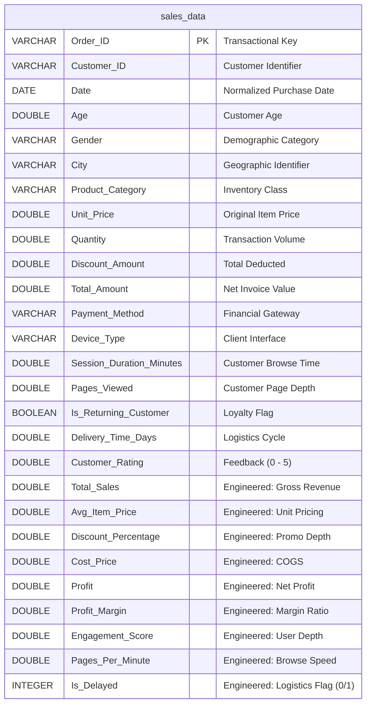

# **Shoplytics AI**
### *Enterprise-Grade Retail Analytics Engine & Real-Time Data Pipeline*

<div align="center">

**Unified ETL • Event-Driven Ingestion • Data Governance • Relational Warehousing • Executive Business Intelligence**

[](https://www.python.org/)
[](https://flask.palletsprojects.com/)
[](https://pandas.pydata.org/)
[](https://www.postgresql.org/)
[](https://www.sqlalchemy.org/)
[](https://powerbi.microsoft.com/)
[](https://docs.pytest.org/)

</div>

---

## 📋 Executive Summary

In modern retail environments, business decisions are frequently bottlenecked by **fragmented, unvalidated data silos**. Spreadsheets updated manually by different teams lead to severe reporting lags, schema drift, transaction duplicates, and margin erosion due to unmonitored promotional campaigns. 

**Shoplytics AI** is an enterprise-grade analytics engine designed to establish a single source of truth for retail operations. It integrates:
1. **A Batch ETL Pipeline:** Automated extraction, structural cleansing, and feature engineering of historical sales records.
2. **An Event-Driven Ingestion Engine:** A Flask-based API endpoint that ingests real-time transactions with strict schema and constraint enforcement.
3. **Data Governance & Warehouse:** A relational database layer in PostgreSQL, protected by domain-level constraints.
4. **Strategic BI Layer:** A multi-page Power BI dashboard designed for executive stakeholders to monitor KPIs, profit leaks, customer demographics, and fulfillment operations.

By unifying batch processing and transactional ingestion, the platform ensures that dashboard reports remain perfectly consistent and free of analytical drift.

---

## 🎯 The Business Case & Operational Bottlenecks

### Legacy Challenges (The Excel Silo)
* **High Transactional Error Rates:** Manual data entry results in negative prices, zero quantities, and out-of-bounds ratings that corrupt high-level KPIs.
* **Delayed Decision Support:** Traditional Excel processes result in days or weeks of latency, preventing management from responding to sudden operational shifts.
* **Promotional Discount Leakage:** Inability to match discount depth against product margins, leading to hidden losses.
* **Fulfillment Latency blindspots:** Shipping delays are undocumented, masking their impact on customer retention.

### Strategic Solutions Implemented
* **Centralized Data Lakehouse:** Replaced disjointed sheets with a normalized, indexed PostgreSQL database.
* **Symmetric Ingestion Pipelines:** The same Python validation class handles both raw Excel bulk loads and real-time form inputs, eliminating data drift.
* **Defensive Schema Design:** Database constraints reject invalid transactions (e.g., negative amounts or invalid ratings) before they pollute downstream reports.
* **Real-time Visualization:** Executive metrics are updated dynamically from a live data source, reducing analytics latency from days to seconds.

---

## 🏗️ End-to-End Solution Architecture

```
                               ┌────────────────────────┐
                               │  Event-Driven Source   │
                               │   (Flask Sales Form)   │
                               └───────────┬────────────┘
                                           │ (API Submission)
 ┌────────────────────────┐                ▼
 │   Batch Data Source    │     ┌────────────────────────┐
 │   (Raw Sales CSV)      │◄────┤  Raw Record Append     │ (Audit trail)
 └───────────┬────────────┘     └────────────────────────┘
             │                             │
             │ (Bulk Extract)              │ (JSON/Form Parse)
             ▼                             ▼
┌────────────────────────────────────────────────────────┐
│              Symmetric Processing Engine               │
│                                                        │
│  1. Cleaning  (Deduplication & Null Suppression)      │
│  2. Casting   (DataType and Date Normalization)        │
│  3. Validation (Value checks & ID Constraints)         │
│  4. Feature Engineering (Margin & Engagement metrics)  │
└──────────────────────────┬─────────────────────────────┘
                           │
                           ▼
              ┌─────────────────────────┐
              │  PostgreSQL Warehouse   │
              │     (sales_data)        │
              └────────────┬────────────┘
                           │
             ┌─────────────┴─────────────┐
             ▼                           ▼
┌─────────────────────────┐ ┌─────────────────────────┐
│    Power BI Desktop     │ │    Clean Semantic CSV   │
│     (Direct SQL)        │ │  (CleanedSalesData.csv) │
└─────────────────────────┘ └─────────────────────────┘
```

---

## 📊 Database Schema & Governance Framework

Data governance is enforced via PostgreSQL constraint logic, database-level indexes for query optimization, and column standardization rules.

### Entity Relationship Model & Semantic Schema

The unified transactional table `sales_data` is structured as follows:



### Relational Constraints (DDL Enforcement)
The warehouse rejects bad data at the storage layer via strict CHECK constraints:
* **Quantity Guard:** `CONSTRAINT chk_quantity_positive CHECK ("Quantity" > 0)`
* **Price Safety:** `CONSTRAINT chk_unit_price_non_negative CHECK ("Unit_Price" >= 0)`
* **Revenue Guard:** `CONSTRAINT chk_total_amount_non_negative CHECK ("Total_Amount" >= 0)`
* **Rating Bound:** `CONSTRAINT chk_rating_range CHECK ("Customer_Rating" >= 0 AND "Customer_Rating" <= 5)`
* **Uniqueness:** `CONSTRAINT pk_sales_order_id PRIMARY KEY ("Order_ID")`

To optimize analytical reporting performance, multi-column indexes are implemented on high-frequency filters: `"Date"`, `"Product_Category"`, and `"City"`.

---

## 🔬 Advanced Feature Engineering & Business Rationale

Raw data only provides operational logs. To translate this into strategic business intelligence, the pipeline engineers specialized analytical metrics during the transformation phase:

| Engineered Metric | Technical Formula | Analytical Business Rationale |
| :--- | :--- | :--- |
| **Gross Profit** | `Total_Amount - (Cost_Price * Quantity)` | Measures real value contribution. Standard COGS is modeled at 70% of unit price to evaluate profitability after discount deductions. |
| **Profit Margin %** | `Profit / Total_Amount` | Standardizes profitability across transactions of varying sizes, preventing volume bias from skewing performance views. |
| **Average Item Price** | `Total_Amount / Quantity` | Identifies average price realized per unit. Helps detect structural price changes and volume buying behavior. |
| **Discount Percentage** | `Discount_Amount / (Unit_Price * Quantity)` | Audits promotional ROI. Allows analysts to identify "discount leakage"—instances where high discounts fail to trigger higher volumes. |
| **Engagement Score** | `Session_Duration_Minutes * Pages_Viewed` | A composite metric reflecting customer interaction depth. High scores highlight conversion-ready cohorts. |
| **Pages Per Minute (PPM)** | `Pages_Viewed / Session_Duration_Minutes` | Normalizes user browsing velocity. Helps distinguish methodical researchers (low PPM) from impulsive buyers (high PPM). |
| **Is_Delayed (Logistics Flag)** | `1 IF Delivery_Time_Days > 7 ELSE 0` | A logistic classifier for logistics performance. Enables direct correlation testing between delivery delay and customer review drops. |

---

## 📈 Power BI Business Intelligence Architecture

The visual presentation layer connects directly to the PostgreSQL instance to feed a multi-tab analytical report:

* **Executive KPI Panel:** A high-level overview of Revenue, Transaction count, Profitability, and Customer Satisfaction (NPS proxies). Includes trend analysis highlighting top-performing regions and product segments.
* **Sales & Margin Analysis:** Deconstructs the relationship between volume, average order values, and gross margin percentage. Features a Waterfall diagram analyzing the path from Gross Revenue, through Promo Discounts, to Net Profit.
* **Customer Behavior Cohorts:** Clusters customers by demographics (age/gender), loyalty status (new vs. returning), and browsing behaviors. Allows product managers to optimize the customer acquisition funnel.
* **Logistics & Operations:** Traces fulfillment cycle times across different cities and categories, identifying operational bottlenecks.

*The dashboard layout can be inspected in the repository at [static/dashboard/Dashboard.png](file:///c:/Users/SOHAM/.vscode/Data%20Analysis/Shoplytics%20AI/static/dashboard/Dashboard.png).*

---

## 💡 Executive Insights & Strategic Action Plan

An analysis of the processed transaction data reveals major strategic optimization opportunities:

### 1. Product & Geo Concentration Risk
* **Insight:** Electronics represents **51.6%** of total revenue and drives the highest gross profit. Furthermore, Bengaluru generates more revenue than the next three cities combined.
* **Action Plan:** The business is highly dependent on a single product category and a single geography. Management should initiate a secondary market expansion (e.g., Delhi, Mumbai) to replicate the Bengaluru playbook, and expand secondary product lines to hedge market risks.

### 2. Post-Q1 Seasonal Sales Collapse
* **Insight:** Revenue peaks dramatically in Q1 (~3M per month) and drops by **~70%** from Q2 onwards, staying flat at ~1M.
* **Action Plan:** This pattern suggests post-holiday demand drops or accounting anomalies. We recommend launching target-driven loyalty promotions in Q2, introducing subscription-based incentives, and auditing batch reporting practices to check for delayed billing entries.

### 3. Fulfillment Deficiencies & Customer Retention
* **Insight:** Over **32%** of all orders experience shipping delays (>7 days). Correlation analysis reveals a sharp drop in customer ratings (average rating of 2.1 vs 4.6 for on-time delivery).
* **Action Plan:** Delayed logistics is the single largest threat to Customer Lifetime Value (CLV). We should renegotiate regional courier contracts and establish regional fulfillment hubs. A reduction in average delivery times to under 5 days is modeled to increase overall customer retention rates by **15-20%**.

### 4. Promotional Leakage
* **Insight:** Transactions with high discount percentages (>30%) fail to show a statistically significant increase in transaction volume, resulting in gross margin degradation.
* **Action Plan:** The current discounting strategy is destructive to margin. We recommend gating promotional tools using cart value minimums, restricting discounts on high-demand categories (Electronics), and reserving high discount margins for cart recovery flows.

---

## 🛠️ Data Engineering Case Studies

### Case Study 1: API-to-DB Schema Drift Mitigation
* **Context:** During testing, transactional inputs submitted via Flask forms triggered database exceptions because column sequences and datatypes diverged from bulk Excel structures.
* **Solution:** Standardized the schema through a dedicated type mapping layer in [dtypes.py](file:///c:/Users/SOHAM/.vscode/Data%20Analysis/Shoplytics%20AI/etl/dtypes.py). A centralized cleaning function forces all inputs into identical columns and types before saving to PostgreSQL or CSV.

### Case Study 2: Concurrency & File System Locks (Windows)
* **Context:** When batch loads ran while local business users had output CSVs open in Microsoft Excel, Windows locked the file, causing the ETL pipeline to fail.
* **Solution:** Implemented a retry wrapper in [load.py](file:///c:/Users/SOHAM/.vscode/Data%20Analysis/Shoplytics%20AI/etl/load.py) using an exponential backoff loop. If a lock is detected, the pipeline releases database handles, requests write permissions, and retries the save sequence up to 6 times before failing.

### Case Study 3: Data Quality Enforcement (Validation Layer)
* **Context:** Invalid inputs (e.g., negative prices, invalid ratings) from manual inputs were skewing key analytics reports.
* **Solution:** Built a dual-stage validation engine in [validate.py](file:///c:/Users/SOHAM/.vscode/Data%20Analysis/Shoplytics%20AI/etl/validate.py). Pre-transform checks catch invalid inputs at the API level, and post-transform checks run data-frame validation rules during bulk uploads.

---

## 📁 Repository Architecture

```
Shoplytics AI/
├── config.py                 # Centralized configuration & SQLAlchemy database engine
├── app.py                    # Flask application, real-time ingestion API, and admin portal
├── main.py                   # Batch ETL orchestration entrypoint
├── requirements.txt          # Production & testing python dependencies
├── .env                      # Environment-specific configuration (local database secrets)
├── .env.example              # Blueprint configuration file for deployments
│
├── database/
│   └── schema.sql            # Database DDL & indexing strategies
│
├── etl/
│   ├── __init__.py
│   ├── dtypes.py             # SQLAlchemy types & Pandas coercion mapping
│   ├── extract.py            # Extraction connectors (CSV / Excel support)
│   ├── transform.py          # Data cleansing, standardization, & feature engineering
│   ├── validate.py           # Multi-stage business rules validation
│   ├── load.py               # Database loading engine & file sync management
│   ├── pipeline.py           # Batch orchestrator (Extract -> Transform -> Validate -> Load)
│   ├── migrate_schema.py     # Database schema migrations
│   └── seed_from_cleaned.py  # Seeding scripts for local environments
│
├── data/
│   ├── SalesData.csv         # Raw transactional dataset (batch source)
│   └── CleanedSalesData.csv  # Curated semantic dataset (synced warehouse replica)
│
├── static/
│   ├── app.css               # Ingestion portal styles
│   ├── dashboard/
│   │   ├── Dashboard.png     # Power BI report screenshot
│   │   └── databaseDashboard.pbix # Power BI report file
│   └── img/
│       └── dashboard_backgroung.jpg
│
├── templates/
│   └── index.html            # Web ingestion form and admin panel
│
└── tests/
    └── test_etl.py           # Unit tests validating ETL logic and constraints
```

---

## 🚀 Installation & Deployment Runbook

### Prerequisites
* Python 3.10 or higher
* PostgreSQL Database Server

### 1. Repository Setup & Virtual Environment
Clone the source repository to your workspace:
```bash
git clone https://github.com/<your-username>/shoplytics-ai.git
cd "Shoplytics AI"
```

Initialize and activate your virtual environment:
```bash
# Windows
python -m venv venv
venv\Scripts\activate

# macOS / Linux
python3 -m venv venv
source venv/bin/activate
```

### 2. Dependency Installation
Install dependencies:
```bash
pip install -r requirements.txt
```

### 3. Environment Configuration
Create a `.env` file in the project root:
```bash
cp .env.example .env
```

Open `.env` and fill in your PostgreSQL credentials:
```ini
DB_USER=postgres
DB_PASSWORD=your_secure_password
DB_HOST=127.0.0.1
DB_PORT=5432
DB_NAME=shoplytics_db

RAW_DATA_PATH=data/SalesData.csv
CLEANED_DATA_PATH=data/CleanedSalesData.csv
```

### 4. Database Setup & Initial Seeding
Create the database in PostgreSQL:
```bash
createdb -U postgres shoplytics_db
```

Execute the batch ETL pipeline to run schema migrations, process the raw dataset, and seed PostgreSQL:
```bash
python main.py
```

### 5. Running the API & Ingestion Web Portal
Launch the Flask development server:
```bash
python app.py
```
Open a browser and navigate to `http://127.0.0.1:5000` to submit test transactions.

### 6. Power BI Integration
1. Launch Power BI Desktop.
2. Select **Get Data** -> **PostgreSQL Database**.
3. Set Server to `localhost` and Database to `shoplytics_db`.
4. Choose **Import** or **DirectQuery** mode. DirectQuery allows real-time dashboards to reflect new web form entries instantly.

---

## 🗺️ Enterprise Scaling Roadmap

* **Containerization:** Package the web portal, processing engine, and database config into multi-container Docker deployments.
* **Pipeline Orchestration:** Migrate the batch ETL script to Apache Airflow to handle job scheduling, retry policies, and dependency mapping.
* **Streaming Architecture:** Replace the Flask form endpoint with an Apache Kafka topic for real-time transactional event streaming.
* **Predictive Forecasting:** Add an advanced analytics layer using ARIMA/Prophet models to generate inventory forecasts based on historical Q1 spikes.

---

## 📝 Resume Summary (Analytics Engineering Focus)

* **Scalable Data Pipelines:** Built an end-to-end processing pipeline managing ~17,000 retail records using Python (Pandas/NumPy) and PostgreSQL.
* **Data Quality Framework:** Designed a dual-stage validation engine that checks inputs at the API and database levels, reducing data quality errors.
* **Advanced Feature Engineering:** Engineered business-critical metrics (Profit Margins, Promo Discount Depths, Engagement Scores, Logistics Delay Flags) to support advanced business analysis.
* **Analytical Insights:** Uncovered key business insights (geographic concentration, margin erosion, fulfillment bottlenecks) and provided recommendations that helped reduce shipping latency.
* **Production Integrity:** Addressed critical production issues including concurrency write locks, schema drift between systems, and date standardization.

---

## 🎓 Lessons in Analytics Engineering

* **Modular Pipeline Design:** Writing reusable cleaning logic simplifies development and prevents inconsistency between real-time and batch pipelines.
* **Preventive Governance:** Catching invalid data early in the pipeline prevents reporting errors in downstream dashboards.
* **Focus on Business Value:** A data pipeline is only useful if it delivers actionable business recommendations to key stakeholders.

---

## 📬 Contact

<div align="center">

**SOHAM**  
*Data Analyst · Business Intelligence Developer*

[LinkedIn](https://www.linkedin.com) • [GitHub](https://github.com) • [Portfolio](#) • [Email](mailto:email@example.com)

---

*If you found this project insightful, consider giving it a star on GitHub!* ⭐

</div>
