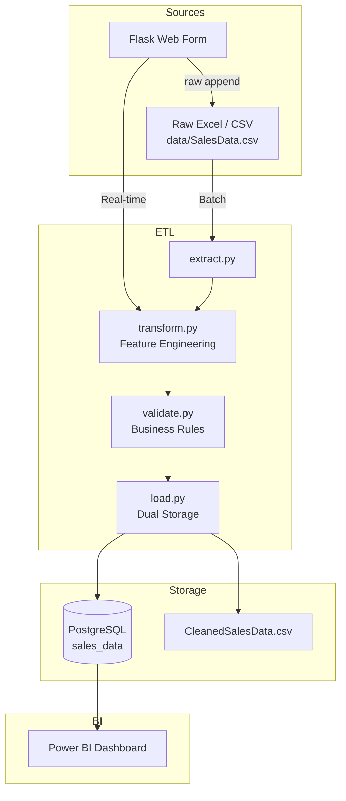

# Shoplytics AI — Real-Time Sales ETL System

Shoplytics AI is an end-to-end **Data Engineering portfolio project** that simulates a real e-commerce sales ingestion system. It combines **batch ETL** and **real-time web ingestion**, applies **feature engineering**, enforces **data quality rules**, and persists curated data to **PostgreSQL + CSV** for Power BI analytics.

---

## Resume-Ready Summary (copy-paste)

> Built a production-style sales ETL system using Flask, Pandas, SQLAlchemy, and PostgreSQL with dual ingestion (batch + real-time). Engineered profitability and engagement metrics, enforced validation gates, implemented dual storage (DB + CSV), and connected Power BI for live business intelligence.

---

## 1. Project Overview / Architecture

### Two ingestion paths

| Path | Trigger | Flow |
|---|---|---|
| **Batch** | `python main.py` or `POST /run-etl` | `Raw Excel/CSV → Extract → Transform → Validate → Load (replace)` |
| **Real-time** | Flask form `POST /submit` | `Form → Validate → Raw CSV append → Transform → Validate → Load (append)` |

Both paths write to:
- **PostgreSQL** table `sales_data` (primary source for Power BI)
- **Cleaned CSV** at `CLEANED_DATA_PATH` (analytics backup / flat-file access)

### Architecture diagram



### End-to-end flow

1. **Batch ETL** reads raw data from `RAW_DATA_PATH` (`.xlsx` or `.csv`).
2. Data is cleaned, deduplicated, and feature-engineered.
3. Validation blocks invalid records before storage.
4. PostgreSQL table `sales_data` is **replaced**; cleaned CSV is **overwritten**.
5. **Real-time form** submits a single record → validated → appended to raw CSV → transformed → appended to PostgreSQL + cleaned CSV.
6. **Power BI** connects to PostgreSQL and refreshes to show latest data.

### Batch + real-time sync

Form submissions append to the **raw CSV** (`append_raw_csv`). When batch ETL runs again, it reloads from that same raw source — so web-submitted records are **not lost**.

---

## 2. Key Highlights

- Real-time + batch ingestion in one system
- Modular ETL package (`extract`, `transform`, `validate`, `load`, `pipeline`)
- Feature engineering for analytics-ready outputs
- Dual storage (PostgreSQL + CSV)
- Centralized SQLAlchemy engine in `config.py`
- Structured logging (`utils/logger.py`)
- Duplicate `Order_ID` prevention on real-time inserts
- Power BI connected to PostgreSQL

---

## 3. Tech Stack

| Layer | Technology |
|---|---|
| Web framework | Flask |
| Data processing | Pandas, NumPy |
| Database | PostgreSQL |
| ORM / connector | SQLAlchemy, psycopg2-binary |
| Excel support | openpyxl |
| Configuration | python-dotenv |
| BI | Power BI (`.pbix` in `static/dashboard/`) |
| Testing | pytest |
| Frontend | Jinja2 + custom CSS |

---

## 4. Feature Engineering

| Feature | Formula |
|---|---|
| `Total_Sales` | `Total_Amount` |
| `Avg_Item_Price` | `Total_Amount / Quantity` |
| `Discount_Percentage` | `Discount_Amount / (Unit_Price × Quantity)` |
| `Cost_Price` | `Unit_Price × 0.70` |
| `Profit` | `Total_Amount − (Cost_Price × Quantity)` |
| `Profit_Margin` | `Profit / Total_Amount` |
| `Engagement_Score` | `Session_Duration_Minutes × Pages_Viewed` |
| `Pages_Per_Minute` | `Pages_Viewed / Session_Duration_Minutes` |
| `Is_Delayed` | `1` if `Delivery_Time_Days > 7`, else `0` |

---

## 5. Database Details

| Item | Value |
|---|---|
| Database name | `DB_NAME` from `.env` |
| Table | `sales_data` |
| Primary key | `Order_ID` (documented in `database/schema.sql`) |
| Batch load | `if_exists="replace"` |
| Real-time load | `if_exists="append"` |
| Stored data | Raw columns + all engineered features |

### Manual schema (optional)

```bash
psql -U <user> -d <dbname> -f database/schema.sql
```

---

## 6. CSV Output Behavior (Dual Storage)

| File | Purpose | Batch | Real-time |
|---|---|---|---|
| `RAW_DATA_PATH` (e.g. `data/SalesData.csv`) | Raw source of truth | Read | Append |
| `CLEANED_DATA_PATH` (e.g. `data/CleanedSalesData.csv`) | Curated analytics file | Overwrite | Append |

Excel (`.xlsx`) is supported for batch extract. Real-time form entries are always appended as CSV rows so batch reload stays in sync.

---

## 7. Validation Rules

| Rule | Enforcement |
|---|---|
| No null values | `validate_data()` |
| `Quantity > 0` | batch + single |
| `Unit_Price >= 0` | batch + single |
| `Total_Amount >= 0` | batch + single |
| `Customer_Rating` in 0–5 | batch + single |
| No duplicate `Order_ID` in batch | `validate_data()` |
| No duplicate `Order_ID` in DB | `validate_order_id_unique()` |
| Required fields | `Order_ID`, `Customer_ID`, `Date`, `City` |

Invalid records **never reach PostgreSQL**.

---

## 8. Error Handling / Edge Cases

- Empty optional numeric fields → converted to `0`
- `Is_Returning_Customer` → `"1"`/`"0"` converted to `True`/`False`
- CSV file locked (Excel open) → retries, then warning (PostgreSQL write still succeeds)
- Duplicate `Order_ID` → blocked with clear UI error
- Missing raw file → extract tries fallback paths automatically

---

## 9. Environment Variables

Copy `.env.example` to `.env` (your credentials are already configured):

```env
DB_USER=your_user
DB_PASSWORD=your_password
DB_HOST=localhost
DB_PORT=5432
DB_NAME=your_database_name

RAW_DATA_PATH=data/SalesData.csv
CLEANED_DATA_PATH=data/CleanedSalesData.csv
```

Supported raw formats: `.xlsx`, `.xls`, `.csv`

---

## 10. Setup and Run

```bash
python -m venv venv
.\venv\Scripts\activate
pip install -r requirements.txt
```

### Run batch ETL only

```bash
python main.py
```

### Run Flask app (real-time + on-demand batch)

```bash
python app.py
```

Open: `http://127.0.0.1:5000`

### API routes

| Method | Route | Purpose |
|---|---|---|
| GET | `/` | Data entry form |
| POST | `/submit` | Real-time single-record ingestion |
| POST | `/run-etl` | Trigger batch ETL on demand |
| GET | `/api/recent` | Last N records (JSON) |
| GET | `/api/stats` | KPI summary (JSON) |

---

## 11. Testing / Verification

### Run unit tests

```bash
pytest tests/ -v
```

### Verify PostgreSQL

```sql
SELECT COUNT(*) FROM sales_data;

SELECT "Order_ID", "Profit", "Engagement_Score", "Discount_Percentage"
FROM sales_data
ORDER BY "Date" DESC
LIMIT 10;
```

### Verify real-time insert

1. Submit a record from the web form
2. Confirm success message
3. Re-run the SQL above — new row should appear
4. Refresh Power BI dataset

### Verify CSV append

Open `data/CleanedSalesData.csv` — a new row should appear after each successful submission.

---

## 12. Project Structure

```
Shoplytics-AI/
├── app.py                  # Flask routes + real-time ingestion
├── main.py                 # Batch ETL entry point
├── config.py               # .env config + shared SQLAlchemy engine
├── requirements.txt
├── .env.example
├── README.md
├── data/
│   ├── SalesData.csv           # Raw source (batch input + form append)
│   ├── raw_sales.xlsx          # Excel source (optional)
│   └── CleanedSalesData.csv    # Curated output
├── database/
│   └── schema.sql              # DDL with constraints
├── etl/
│   ├── extract.py              # Excel/CSV extraction
│   ├── transform.py            # Cleaning + feature engineering
│   ├── validate.py             # Business rules + duplicate checks
│   ├── load.py                 # PostgreSQL + CSV dual storage
│   ├── pipeline.py             # Batch orchestration
│   └── seed_from_cleaned.py    # One-off DB seed utility
├── tests/
│   └── test_etl.py             # Unit tests
├── templates/
│   └── index.html
├── static/
│   ├── app.css
│   └── dashboard/              # Power BI files
└── utils/
    └── logger.py               # Structured logging
```

---

## 13. Future Improvements

- Automated Power BI dataset refresh (Power BI REST API)
- Streamlit or embedded analytics dashboard
- Sales forecasting / anomaly detection ML model
- Docker + cloud deployment (Render / AWS / Azure)
- CI/CD pipeline with GitHub Actions
- API authentication for `/run-etl` admin endpoint

---

## 14. Why This Project Matters

In e-commerce, delayed or dirty data leads to bad decisions. Shoplytics AI demonstrates how a Data Engineer builds a reliable ingestion layer: validate early, engineer features once, store in both relational DB and flat files, and serve BI tools from a single source of truth.
